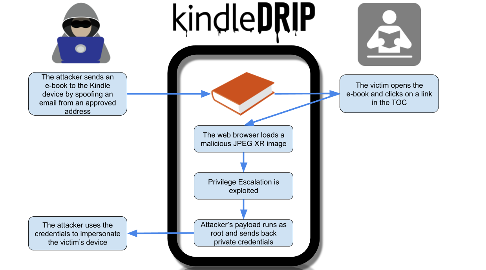
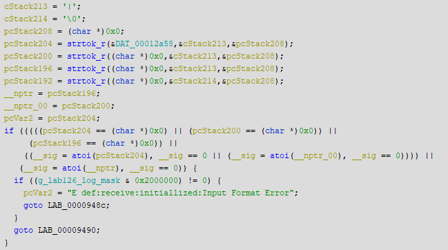

# KindleDrip — From Your Kindle’s Email Address to Using Your Credit Card

Or the story of how I received an 18K$ bug bounty for a critical Amazon Kindle vulnerability.

For any questions and inquiries about KindleDrip, you may contact me at [baronyogev+kindledrip@gmail.com](mailto:baronyogev+kindledrip@gmail.com).

If you are interested in a security audit for your products, or special security research, you can contact Realmode Labs at [contact@realmodelabs.com](mailto:contact@realmodelabs.com).

Thanks to [Yaar Hahn](undefined) for the help with this project.

## Introduction

Some time ago, we noticed at [Realmode Labs](https://realmodelabs.com/) that Amazon Kindle has an interesting feature called “Send to Kindle”.
This feature allows Kindle users to send e-books to their device as email attachments.
We immediately thought of the potential security concerns of this feature: what if we can send malicious e-books to unsuspecting users?

I started researching the potential issues, and sure enough, found three vulnerabilities which together **allow an attacker to remotely execute code on the Kindle**.
The code runs as root, and the attacker only needs to know the email address assigned to the victim’s device.

The attacker could access device credentials and make purchases on the Kindle store using **the victim’s credit card**.
Attackers could sell an e-book on the store and *transfer money to their account*.
At least the confirmation email would make the victim aware of the purchase.
> # Attackers could sell an e-book on the store and *transfer money to their account.*

The first vulnerability allowed an attacker to send an e-book to the victim’s Kindle device.
Then, the second vulnerability was used to run arbitrary code while the e-book is parsed, under the context of a weak user.
The third vulnerability allows the attacker to escalate privileges and run code as root.

Amazon has already released a software update fixing this issue.
Users do not need to take any action as their devices will be automatically updated after being connected to the internet.

*KindleDrip attack flow*

## Book Injection

So what is [Send to Kindle](https://www.amazon.com/gp/sendtokindle/email) all about?
As was mentioned before, it allows the Kindle user to send [MOBI](https://en.wikipedia.org/wiki/Mobipocket) e-books to their device.
To accomplish that, Amazon generates each user a special kindle.com email address used specifically for this feature.
Users can send an e-book as an attachment to this email address from a predefined list of approved emails, and the book will appear on their device.

Wait, a predefined list of approved addresses?
So what is the issue?
Well, [email authentication](https://en.wikipedia.org/wiki/Email_authentication) is still not as widespread as you may think.
Since many email servers still don’t support authentication, it is not unreasonable to assume that Amazon will not verify the authenticity of the sender.

To test this, I used an [email spoofing service](https://emkei.cz/) to spoof an email message and send an e-book to my device.
To my pleasant surprise, the e-book *appeared on the device*!
To make matters worse, there is no indication that the e-book was received from an email message.
It also appeared on the home page of the Kindle with a cover image of our choice, which makes phishing attacks much easier.

One thing that does provide security for this feature is the *destination email address*.
The attacker must predict this email address.
However, it is just the user’s regular email under the kindle.com domain (e.g.
name@gmail.com turns into name@kindle.com).
Some users have a random string appended to their name (name_<random_string>@kindle.com), but the entropy on most of the addresses seem to be very low, and it can be bruteforced.
The newest users have an address with a maximal entropy of 32 bits, which is still not very good.

## Reverse-Engineering the Kindle Firmware

Now that there is a way to send e-books to any Kindle device, I needed to find a way to execute code from the e-book.
For this I reverse-engineered the book parsing code on the (then newest) Kindle firmware version 5.13.2.
[KindleTool](https://github.com/NiLuJe/KindleTool) was used to extract the filesystem from the firmware update file.
I also had an old jailbroken Kindle PaperWhite 3 (in addition to a new Kindle 10).
It allowed me to debug any process using the gdb binary that comes with the firmware (what a pleasant surprise!), and I reverse-engineered the arm32 binaries using [Ghidra](https://github.com/NationalSecurityAgency/ghidra).

While looking at the various libraries present on the firmware, one library stood out: libjpegXR.so.
It seemed to parse an obscure image format called jpegXR — a perfect attack surface.

## JPEG XR Vulnerability

[JPEG XR](https://en.wikipedia.org/wiki/JPEG_XR) is an image format standard originally developed by Microsoft.
The Kindle supports this format when parsing the newest Kindle file format — KFX.
Since only MOBI files can be sent using the previous vulnerability, it seemed irrelevant.
I tried to look for other code that supports JPEG XR, and found that the integrated web browser supports it as well.
The web browser fits, since MOBI files support web links (and they are even visually identical to TOC links), so a click on a link in the book will open the browser.

### Quantization Parameters Buffer-Overflow

I started reading the [official reference code](https://jpeg.org/jpegxr/software.html) of the JPEG XR standard.
I noticed the following in the jxr_image struct defined in jxr_priv.h:

    unsigned char dc_quant_ch[MAX_CHANNELS];
    unsigned char lp_quant_ch[MAX_CHANNELS][MAX_LP_QPS];
    unsigned char hp_quant_ch[MAX_CHANNELS][MAX_HP_QPS];

Those are called the “quantization parameters”.
The function _jxr_r_TILE_HEADER_HIGHPASS implemented in r_parse.c* *fills hp_quant_ch* *with data provided in the image file.
The length of the copied data is defined by image->num_channels, which is also provided in the image file.
The size of the buffer is constant (MAX_CHANNELS=16), so there seems to be potential for a buffer-overflow.

The reference code prevents this issue with an assert that checks num_channels is less then MAX_CHANNELS.
But maybe the Kindle developers missed it?
I popped libjpegXR.so in Ghidra to look at how they chose to implement it.
I immediately saw that it was heavily based on the reference code, but the assert was not there!
Maybe they removed it in the many edits they did, or simply compiled asserts out in production.
Either case, there was a buffer-overflow while parsing JPEG XR in the Kindle, with controlled bytes from the JPEG XR image file.

### Exploitation

In the jxr_image struct, immediately following the overflowed buffer, there is the pointer struct jxr_tile_qp *tile_quant.
The function _jxr_r_TILE_HEADER_HIGHPASS copies hp_quant_ch to this pointer:

    memcpy(image->tile_quant[ty*(image->tile_columns) + tx].hp_quant_ch, image->hp_quant_ch, MAX_CHANNELS*MAX_HP_QPS);

Hence, using the overflow, tile_quant could have been overridden to obtain an absolute-write primitive (write attacker-controlled data to attacker-controlled address).
It gets better: the amount of times _jxr_r_TILE_HEADER_HIGHPASS is called is defined by image->tile_columns and image->tile_row, which are also provided in the image file.
Thus, the absolute-write primitive could be used many times with a single image file.

Now, let’s look at the memory mapping of the web browser process mesquite:

    00008000–000a0000 r-xp 00000000 b3:01 1939 /usr/bin/mesquite
    000a0000–000a2000 rwxp 00098000 b3:01 1939 /usr/bin/mesquite
    000a2000–002b8000 rwxp 00000000 00:00 0 [heap]
    …

The binary is loaded to a constant address, and it has an *executable & writable* section.
Together with the absolute-write primitive, exploitation was easy.
Using the absolute-write primitive, a shellcode could be written to the executable section.
Then, the primitive could be used again to “spray” the [Global Offset Table](https://en.wikipedia.org/wiki/Global_Offset_Table) (GOT) with the address of the shellcode.
The mesquite process is multi-threaded, so one of the other threads would inevitably call a function from the GOT, causing the shellcode to execute.

## Privilege Escalation

The mesquite* *process is run under chroot with a weak user called framework.
So the previous vulnerability couldn’t be used to even reboot the device.
Privilege escalation was needed.

I started looking for root processes that listen on a local socket:

    [root@kindle root]# netstat -ntpl | tail -n +3 | awk '{ print $7 }' | awk -F / '{ print $1 }' | xargs -I {} ps -o uname=,cmd= -p {}

    9000     /app/bin/AaMenuApplication
    9000     webreader
    root     stackdumpd
    9000     kfxreader -l
    9000     /usr/java/bin/cvm -Xmx49m -Xms49m ...
    root     fastmetrics
    9000     kfxview
    9000     /usr/java/bin/cvm -Xmx49m -Xms49m ...

stackdumpd* *seemed promising, so I opened it in Ghidra to see what it does.
From what I understand, this process is responsible for generating stack dumps of crashed processes.
It receives information like the crashed process id and thread id, and passes it to /usr/bin/dump-stack.
This is a shell script that connects to the crashed process with gdb (so this is why it is present in the firmware!), and like the name suggests, dumps the stack.
From the shell script:

    ${GDB} --quiet \
        --se "${PROCESS_EXE}" \
        --pid ${CURRENT_TID} \
        --batch \
        -ex "bt" \
        -ex detach

Notice that CURRENT_TID* *was not quoted, so it may be possible to inject parameters to gdb.
Since gdb can run arbitrary commands given in thecommand argument, it could have been used to run arbitrary code as root.

The situation was a little more complicated.
It seems that the developers were aware of this issue, and tried to prevent it by making sure that CURRENT_TID* *is a number.
The first check happens in dumpstackd* *and it is checking that atoi* *does not return 0:

The second check is in dump-stack and it uses regex:

    “$(echo “$CURRENT_TID” | grep ‘^[0–9]*$’)” != “”

The atoi check can be bypassed simply by starting our string with digits.
The regex check is bypassed by putting a new-line character after the digits.
Hence a simple string like “1\nsome string” will bypass both checks.
Thus, we had a vulnerability that allowed us to execute arbitrary code under the context of the root user.
Chaining it with our previous two vulnerabilities, we got a root RCE on the Kindle.

## Proof of Concept

Following is a short video demonstrating the full exploit chain on a new Kindle 10 with firmware version 5.13.2.

• The attack starts by sending a malicious e-book from the approved email address, using email spoofing.

• Then, the victim enters the innocent-looking book and touches one of the links in the table of contents.

• The link opens the browser with an HTML page that contains a malicious JPEG XR image.

* The image is parsed and malicious code now runs as root.
The payload changes the boot background and restarts the device.

* The attacker receives private credentials from the device and logs in to the victim’s account.

<iframe width="560" height="315" src="https://www.youtube.com/embed/S6dPM1KHyYA" frameborder="0" allowfullscreen></iframe>

## Timeline

• Oct 17th 2020: Report sent through the [Amazon Vulnerability Research Program](https://hackerone.com/amazonvrp).

• Oct 19th 2020: Amazon acknowledges the issues.

• Nov 4th 2020: Rewarded 12K$ bounty.

• Nov 11th 2020: Rewarded an additional 6K$ bounty from the Amazon Vulnerability Research Program holiday reward promotion.

• Dec 10th 2020: Firmware version 5.13.4 is released with fixes for the JPEG XR overflow and the PE.

• Dec 29th 2020: Reviewed fixes deployed by Amazon, per their request.

• Jan 19th 2021: This publication is approved.

## Remediation

### Book Injection

In cases where Amazon cannot authenticate the sending email address, they now send a verification link to the approved address:

### JPEG XR Overflow

Amazon fixed the overflow with a simple check that the number of channels does not exceed MAX_CHANNELS .

### Privilege Escalation

The code in dumpstackd* *changed to:

As you can see, they replaced the atoi* *call with a new function that specifically checks that the string contains only digits.

Regarding /usr/bin/dump-stack, the file diff between the firmwares speaks for itself.
The regex check is now more robust:

    < PROCESS_PID=$1
    < PROCESS=$2
    < CURRENT_TID=$3

    ---

    > PROCESS_PID=$(echo $1 | head -n 1 | grep '^[[:digit:]]*$')
    > PROCESS=$(echo $2 | head -n 1 | grep '^[[:alnum:]_]*$')
    > CURRENT_TID=$(echo $3 | head -n 1 | grep '^[[:digit:]]*$')

## Conclusion

Using three different vulnerabilities, I managed to execute arbitrary code on the Amazon Kindle as the root user, given only the email address assigned to the device.
This could have allowed an attacker to access device credentials and make purchases on the Kindle store.
This could also have been used to jailbreak the newest Kindle devices.
Amazon took the report seriously and fixed the issues in a reasonable time.
